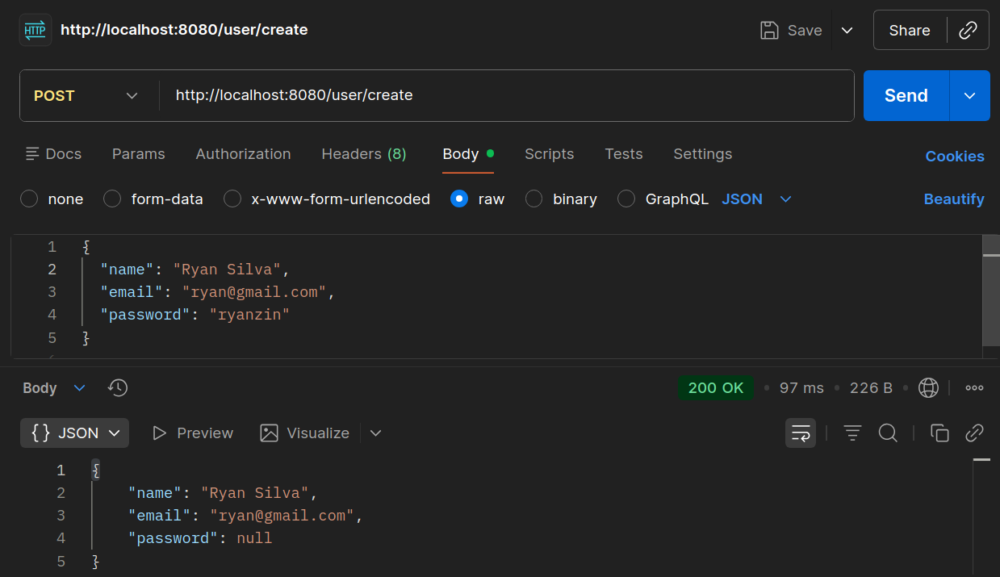
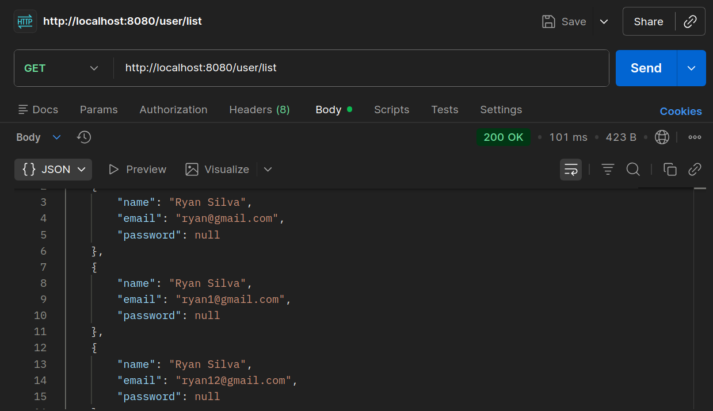
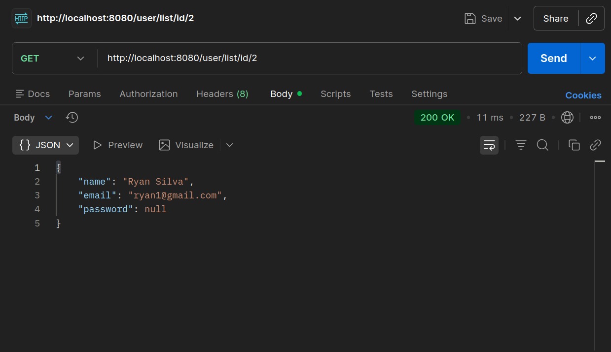
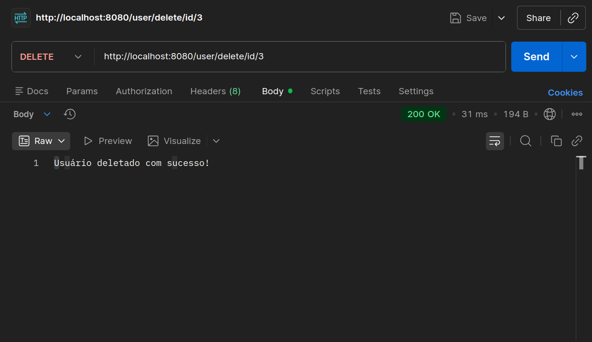
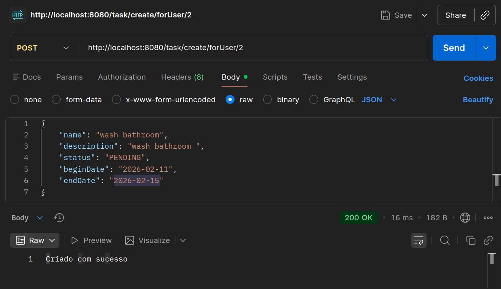
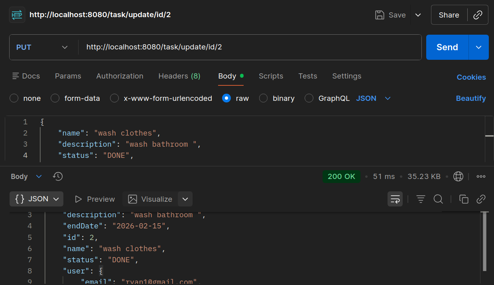
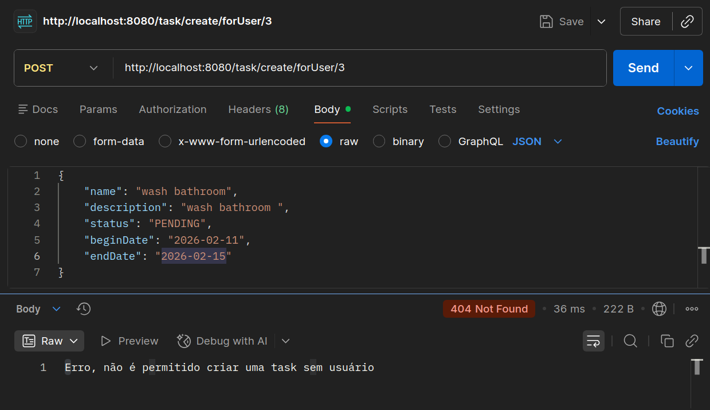

---

# 📌 Projeto: To-Do List

## 🎯 Objetivo
Implementar corretamente o relacionamento **Um-para-Muitos** utilizando **JPA/Hibernate**, garantindo a persistência e consulta dos dados relacionados.

## 🗂️ Modelagem

### Usuário
- `id`
- `nome`
- `email`
- `tarefas` (lista de tarefas)

### Tarefa
- `id`
- `titulo`
- `descricao`
- `concluida`
- `usuario` (referência ao usuário)

### Regras de Negócio
- Um **Usuário** pode ter várias **Tarefas**
- Uma **Tarefa** pertence a apenas um **Usuário**
- Não deve existir tarefa sem usuário associado
- A chave estrangeira fica na tabela de **Tarefa**

---

## 🔗 Endpoints Obrigatórios

- `POST /usuarios/{id}/tarefas` → Criar tarefa vinculada a um usuário
- `GET /usuarios/{id}/tarefas` → Listar tarefas de um usuário específico
- `PUT /tarefas/{id}` → Atualizar tarefa
- `DELETE /tarefas/{id}` → Deletar tarefa

---

## 🧪 Testes (Postman/Insomnia)

### Criar Usuário

### Mostrar Todos Usuários

### Buscar Usuário por ID

### Deletar Usuário por ID

### Criar Tarefa vinculada a Usuário

### Atualizar Tarefa

### Erro ao tentar criar tarefa sem usuário

---

## 📖 Explicação do Relacionamento 1:N

O relacionamento **Um-para-Muitos (1:N)** foi implementado da seguinte forma:

- **Usuário** possui uma lista de tarefas (`@OneToMany`)
- **Tarefa** possui uma referência ao usuário (`@ManyToOne`)
- A chave estrangeira (`usuario_id`) está na tabela de **Tarefa**, garantindo que nenhuma tarefa exista sem estar vinculada a um usuário.

---

## ✅ Critérios de Avaliação Atendidos
- Mapeamento correto do relacionamento 1:N
- Endpoints funcionando conforme especificado
- Regras de negócio implementadas
- Projeto organizado com README e evidências dos testes

---